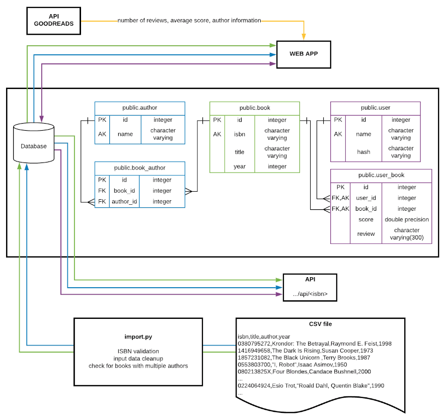
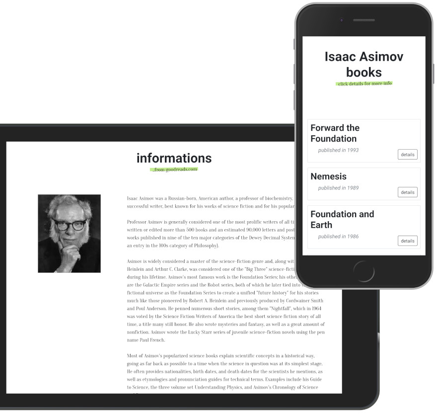
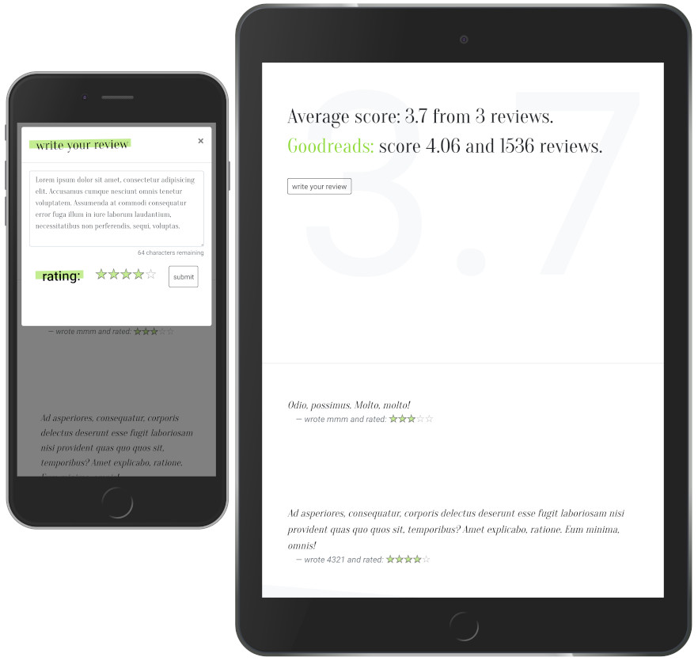

## CS50W2019 Project 1

### About:
A small (5000 books), ["goodreads-like"](https://www.goodreads.com/) book reviews web app inspired 
CS50W Web Programming with Python and JavaScript course.

#### Live demo:
* [web app](https://cs50w-jt-project1.herokuapp.com/)
* [sample api response](https://cs50w-jt-project1.herokuapp.com/api/1594561753)

#### Technologies used:
 * Python 3: flask, WTForms, jinja, unittest, [ISBNdb](https://isbndb.com/apidocs)
 * PostgreSQL 10: Foreign keys, joins, aggregate functions, full text search 
 * SQLAlchemy to execute raw SQL commands 
 * JavaScript, Bootstrap, jQuery, [typeit.js](https://typeitjs.com/), [bootstrap star rating](https://plugins.krajee.com/star-rating)
 * API, JSON, XML parsing.

### How it works:

### How it looks:

#### My role:
App built from scratch. Design, front-end and back-end are my work. 
 * application.py - main config file, and helper functions
 * views.py - all views functions
 * import.py - a command-line tool that allows import data from csv file
 * form.py - forms and validators
 * test.py - unittests

#### Project main requirements:
* Registration: Users should be able to register for your website, providing (at minimum) a username and password.
* Login: Users, once registered, should be able to log in to your website with their username and password.
* Logout: Logged in users should be able to log out of the site.
* Import: Provided for you in this project is a file called books.csv, which is a spreadsheet in CSV format of 5000 different books. Each one has an ISBN number, a title, an author, and a publication year. In a Python file called import.py separate from your web application, write a program that will take the books and import them into your PostgreSQL database. You will first need to decide what table(s) to create, what columns those tables should have, and how they should relate to one another. Run this program by running python3 import.py to import the books into your database, and submit this program with the rest of your project code
* API Access: If users make a GET request to your website’s /api/<isbn> route, where <isbn> is an ISBN number, your website should return a JSON response containing the book’s title, author, publication date, ISBN number, review count, and average score.
* Search: Once a user has logged in, they should be taken to a page where they can search for a book. Users should be able to type in the ISBN number of a book, the title of a book, or the author of a book. After performing the search, your website should display a list of possible matching results, or some sort of message if there were no matches. If the user typed in only part of a title, ISBN, or author name, your search page should find matches for those as well!
* Book Page: When users click on a book from the results of the search page, they should be taken to a book page, with details about the book: its title, author, publication year, ISBN number, and any reviews that users have left for the book on your website.
* Review Submission: On the book page, users should be able to submit a review: consisting of a rating on a scale of 1 to 5, as well as a text component to the review where the user can write their opinion about a book. Users should not be able to submit multiple reviews for the same book.
* Goodreads Review Data: On your book page, you should also display (if available) the average rating and number of ratings the work has received from Goodreads.
* You should be using raw SQL commands (as via SQLAlchemy’s execute method) in order to make database queries. You should not use the SQLAlchemy ORM (if familiar with it) for this project.
* In README.md, include a short writeup describing your project, what’s contained in each file, and (optionally) any other additional information the staff should know about your project.
* If you’ve added any Python packages that need to be installed in order to run your web application, be sure to add them to requirements.txt!

#### Personal touch and additional features:
* authors and books are divided into separate tables to prevent data duplication (one author could write many books, and also one book could have more than one author)
* landing page for author details with photo, description and list of books from database 
* full text search instead of LIKE 
* form validation errors are caught and displayed by flash massages
* errors in the production environment are logged into the file
* error handler and custom pages for 4** and 5** errors
* users are able to edit submitted reviews
* if the user submits valid ISBN code into the search form, app redirects directly into the book details page
* customized bootstrap to improve app look

#### More info about course and project:
* [CS50](https://cs50.harvard.edu/college/)
* [CS50 Web Programming with Python and JavaScript](https://www.edx.org/course/cs50s-web-programming-with-python-and-javascript)
* [Project 1](https://docs.cs50.net/web/2019/x/projects/1/project1.html)